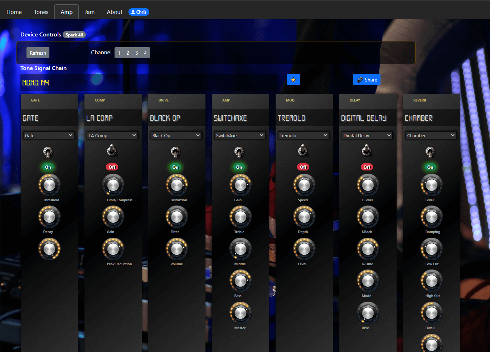

# Soundshed

Desktop and Web UI which can be used to:
- manage tone library and browse tone communities
- connect to supported amp via bluetooth, manage basic settings and set presets.
- browse and favourite video backing tracks

Download from https://soundshed.com or check out the web app version.

Windows, macOS and Linux. 64-but OS and Bluetooth (BLE) connectivity required.

*Supported amps:*
- Positive Grid Spark 40 and Spark Mini: https://www.positivegrid.com/spark/

### Known Issues
- Invalid settings may crash amp, requiring amp to be switched off and on again.

## Roadmap

Possible future features include:

- More reliable amp communication
- UI refinements
- More tone community features
- Lessons (community supplied links to video lessons etc)
- artist and song metadata for correct cross reference of tones, backing tracks and lessons.
- Support for an extensible range of amp and FX units
    - Abstraction to map device fx settings to a "soundshed" generic list of common FX.
    - For new devices implement read/write of presets/fx settings from the device and mappings to generic fx
    - Allow presets made for any device to be approximately mapped to any other support device.
    - Provide preset cloud for devices which don't natively have one.
    - Possibly extend presets to include impulse response (IR) waveforms for devices that support them.
    - Example Target devices: Line 6 Pod Go, Boss Katana MK II

#### Event Mapping
Input event from keyboard or midi can be mapped to either a preset slot (e.g. channels 1-4). The app can currently learn some midi control inputs and assign them to channel selections.

#### Default FX
- default slot settings (fx type, parameter settings) can be applied, e.g a default Noise Gate configuration which can either be applied all the time or on demand.

## Build

- Prerequisites: Node JS 16.x or higher, npm 6.14 or higher. Windows, macOS or Linux

- VS Code is the recommended editor

- If working on the Lessons portion, you will need to add your youtube-data-api key to the `/src/env.ts` file. More information available [here](https://developers.google.com/youtube/v3/getting-started). Please do not submit this file in pull requests.

- Clone this repository
- run `npm install` on the repo path

## Run Web Version
- edit platformUtils.ts to include platformUtils.web.ts, edit env.ts to be web mode
- Run `npm run watch-web` in one terminal to continuously rebuild the UI code or `npm run build-web` to just build once. Note that there is a build for the app UI and a build for the electron main process, some of which use the same files (types etc).
- Run `npx http-server build` to start local web server on http://localhost:8080/
- Example with SSL enabled: `npx http-server build --ssl -K C:/Work/Misc/ssl/localhost-key.pem -C C:/Work/Misc/ssl/localhost.pem`

## Run Electron Version
- edit platformUtils.ts to include platformUtils.electron.ts, edit env.ts not to be web mode
- Run `npm run watch-electron` in one terminal to continuously rebuild the UI code or `npm run build-electron` to just build once. Note that there is a build for the app UI and a build for the electron main process, some of which use the same files (types etc).
- Run `npm run start-electron` to launch the UI

The final installable app is packaged using electron-forge:
`npm run make`

## Toggle between web and electron mode
- edit env.ts, set IsWebMode true/false
- edit platformUtils.ts, import required platform

## Release Process 
- Electron
    - ensure electron config selected
    - ensure webpack.electron.config is set to production
    - Increment version in package.json, run installer Github Action, run Release Github Action, Edit release notes.
- Web
    - ensure web config selected
    - ensure webpack.web.config is set to production
    - Run build and deploy files
    
### Architecture
The app is built using TypeScript. For the electron version, electron/node is the host process, talking to the electron renderer and back again (the standard electron way of working). Both web and electron versions now use Web Bluetooth (BLE).

The UI is React (TypeScript variant) with bootstrap for UI css. The Pullstate library is use for app state management and a couple of view model classes exist to centralise common points of interaction with APIs, the devices and state.

Original template is loosely based on https://www.sitepen.com/blog/getting-started-with-electron-typescript-react-and-webpack

